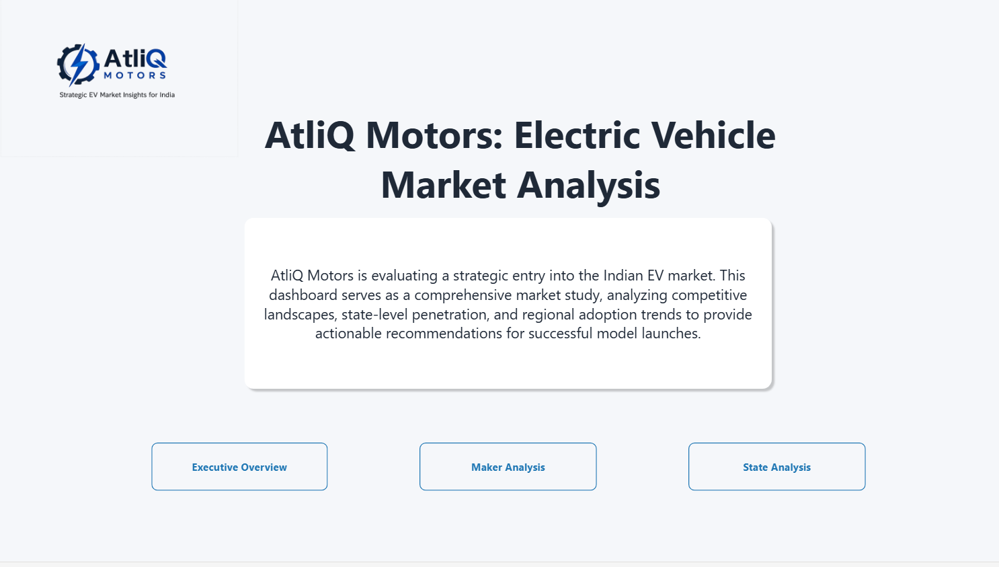
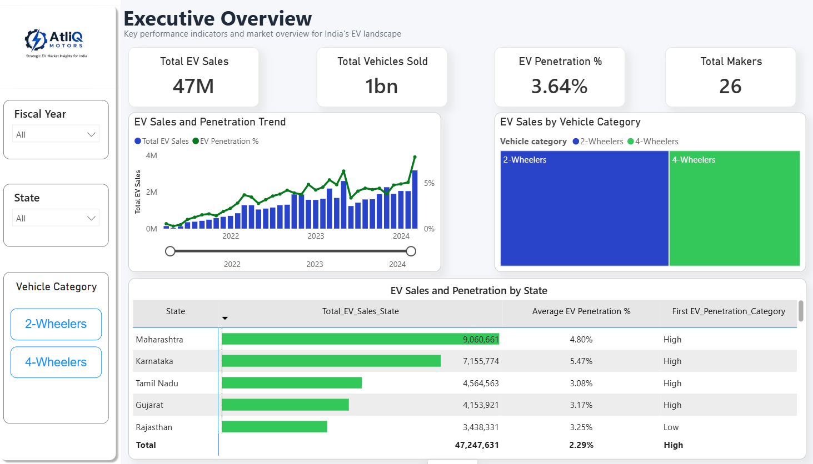
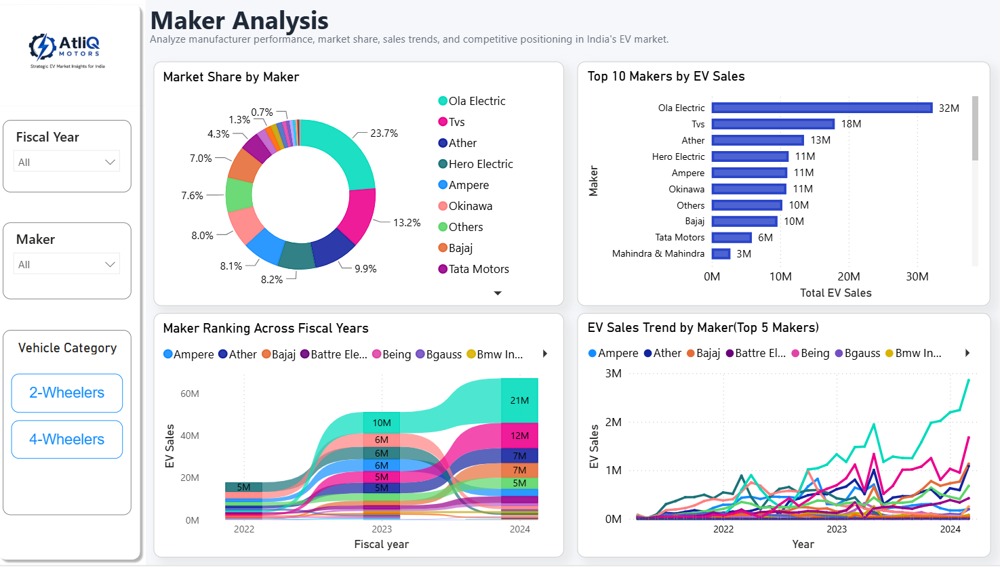
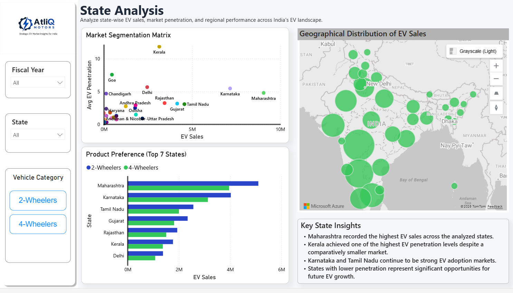

<h1 align="center">⚡ AtliQ Motors EV Market Analysis</h1>

<p align="center">
End-to-End Data Analytics Project using Excel, MySQL, Python & Power BI
</p>

<p align="center">


</p>

<h3 align="center">👨‍💻 Pranav Shrivastav</h3>

<p align="center">
Data Analyst • SQL • Python • Power BI
</p>

---

# About The Project

This project presents an end-to-end analysis of the Indian Electric Vehicle (EV) market for AtliQ Motors, a leading EV manufacturer planning to expand into India.

The analysis covers the complete data analytics workflow, starting from raw datasets and progressing through data cleaning, exploratory data analysis (EDA), SQL-based business analysis, and interactive Power BI dashboards. The objective is to identify market trends, leading manufacturers, state-wise performance, and EV adoption patterns that can support business expansion decisions.

---

# Business Problem

AtliQ Motors has a strong presence in the North American EV market but currently holds a very small market share in India.

Before launching its products, the company wants to understand:

- Current EV market growth
- State-wise EV demand
- Leading manufacturers
- EV penetration trends
- Future market opportunities

This analysis helps support business decisions with real market data.

---

# Project Workflow

```text
Raw Dataset
      │
      ▼
Data Cleaning (Python)
      │
      ▼
Exploratory Data Analysis
      │
      ▼
Clean Dataset
      │
      ▼
SQL Business Analysis
      │
      ▼
Power BI Dashboard
      │
      ▼
Business Insights
      │
      ▼
Recommendations
```

---

# Tools Used

| Tool | Purpose |
|------|---------|
| Excel | Raw & Clean Dataset |
| MySQL | Business Query Analysis |
| Python | Data Cleaning & EDA |
| Power BI | Dashboard & Visualization |
| GitHub | Project Documentation |

---

# Dashboard Pages

### 🏠 Home Page

Introduces the project and provides a simple navigation experience. Users can quickly access the Executive Overview, Maker Analysis, and State Analysis dashboards.

### 📈 Executive Overview

Displays key business KPIs such as Total EV Sales, Total Vehicle Sales, EV Penetration, and Total Manufacturers. It also highlights yearly sales trends, vehicle category performance, and overall market growth.

### 🏭 Maker Analysis

Focuses on EV manufacturer performance by comparing market share, yearly sales, fiscal year trends, and manufacturer rankings. It helps identify the leading players in the Indian EV market.

### 📍 State Analysis

Analyzes state-wise EV sales, EV penetration, and regional demand. The dashboard highlights high-performing states and identifies markets with future growth potential.

---

# Dashboard Preview

### 🏠 Home Page



---

### 📈 Executive Overview



---

### 🏭 Maker Analysis



---

### 📍 State Analysis




# Key Business Insights

- Maharashtra recorded the highest EV sales.
- Karnataka and Tamil Nadu remained major EV markets.
- Kerala showed one of the highest EV penetration rates.
- Ola Electric led the 2-Wheeler market.
- 2-Wheelers dominated overall EV sales.
- EV adoption increased consistently across fiscal years.

---

# Business Recommendations

- Focus expansion on high-performing states.
- Prioritize the 2-Wheeler segment.
- Study leading manufacturers for competitive benchmarking.
- Target states with low EV penetration and high vehicle sales.
- Strengthen charging infrastructure partnerships.

---

# Repository Structure

```text
AtliQ_Motors_EV_Market_Analysis
│
├── 01_Project_Overview
│   ├── Problem_Statement.txt
│   ├── Project_Objectives.txt
│   └── Project_Overview.txt
│
├── 02_Excel
│   ├── AtliQ_EV_Raw_Dataset.xlsx
│   ├── AtliQ_EV_Clean_Dataset.xlsx
│   └── Dataset_Description.txt
│
├── 03_SQL
│   ├── Business_Queries1.sql
│   └── Business_Queries2.sql
│
├── 04_Python
│   ├── AtliQ_EDA.ipynb
│   └── EDA_Summary.txt
│
├── 05_Power_BI
│   ├── Electric Vehicle Market Analysis.pbix
│   ├── Dashboard_Explanation.txt
│   ├── Home_Page.png
│   ├── Executive_Overview.png
│   ├── Maker_Analysis.png
│   └── State_Analysis.png
│
├── 06_Business_Insights
│   ├── Key_Insights.txt
│   └── Business_Recommendations.txt
│
├── 07_Assets
│   └── AtliQ_Logo.png
│
└── README.md
```

---

# Live Dashboard

Explore the interactive Power BI dashboard to view the complete analysis.

👉 **[View Interactive Power BI Dashboard](https://app.powerbi.com/view?r=eyJrIjoiNmYwMWU0NjYtYzRmYS00NjVlLTgzZmMtMDNmNmVkN2U5ZTBmIiwidCI6ImM2ZTU0OWIzLTVmNDUtNDAzMi1hYWU5LWQ0MjQ0ZGM1YjJjNCJ9&pageName=e05f82973477f248a6b3)**

---

# Skills Demonstrated

- Data Cleaning & Validation
- Exploratory Data Analysis (EDA)
- Data Transformation
- SQL Query Writing
- Business Analysis
- Power BI Dashboard Development
- DAX Measures
- KPI Development
- Data Visualization
- Business Recommendations

---

# About This Repository

This repository contains all project files, including raw and cleaned datasets, SQL scripts, Python notebooks, Power BI dashboards, business insights, and supporting documentation used throughout the analysis.

If you found this project useful, feel free to explore the repository and the interactive Power BI dashboard.

Thank you for visiting!
